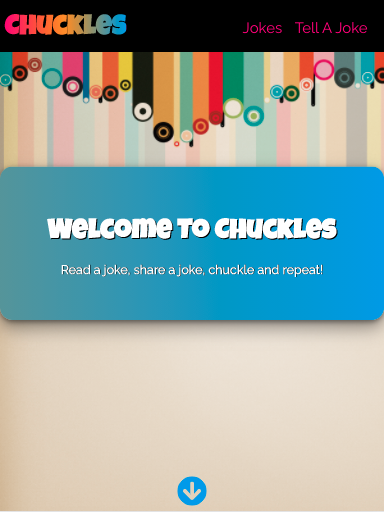
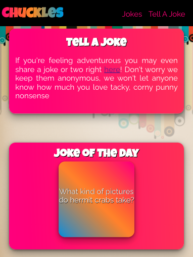
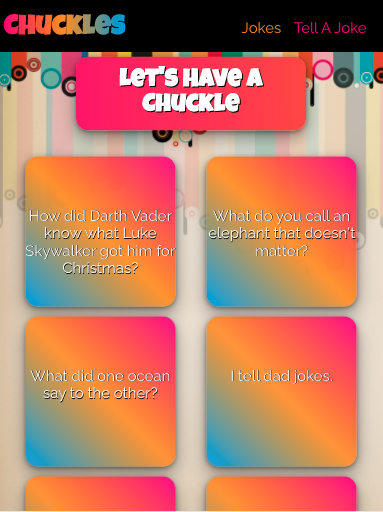
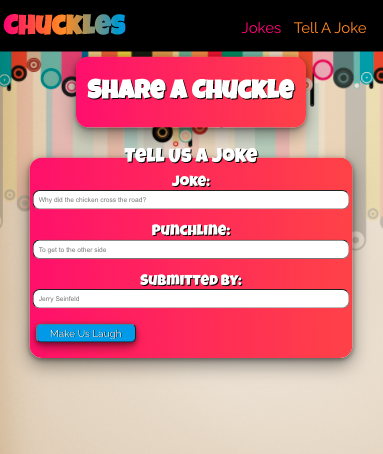

# Chuckles

## Summary:

Chuckles-Api is a server-side project build for a client-side React app that can be viewed [here](https://github.com/CaitlinGreer/chuckles-app.git).  Chuckles was deployed using Heroku.

## Technology:

This project was created using:
* PostgreSQL
* Node.js
* Express

## Check Out the Live Version:

[Chuckles](https://chuckles-app-caitlingreer.vercel.app/)

## API Endpoints
* GET & POST: /api/jokes
* DELETE: /api/jokes/:id

## Screenshots

### Home Page

 

### Jokes Page

### Add A Joke Form Page

